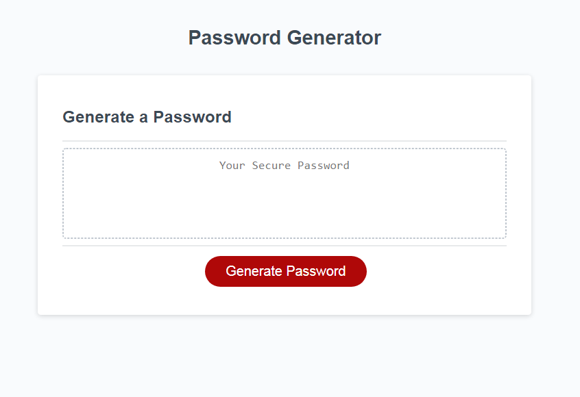
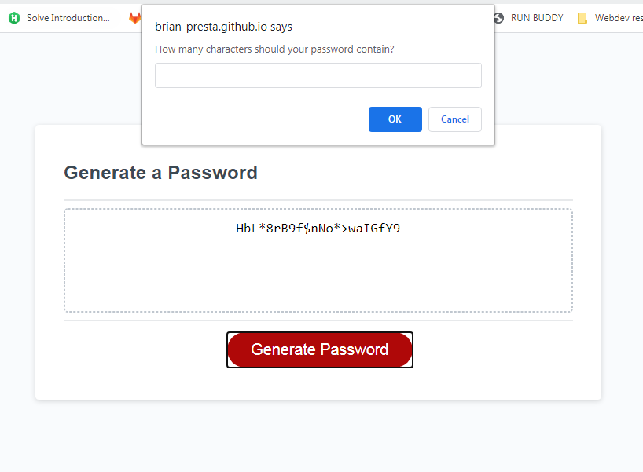

# Password Generator
This project is a basic JavaScript password generator. It can generate passwords from 8-128 characters in length, and the user can include or exclude four categories of characters to be eligible for the generator to pick. 

## Visuals
### Blank Generator

### Populated Generator, also showing JS prompt for a new password

## Deployment 
The project can be viewed live at https://brian-presta.github.io/password-generator/